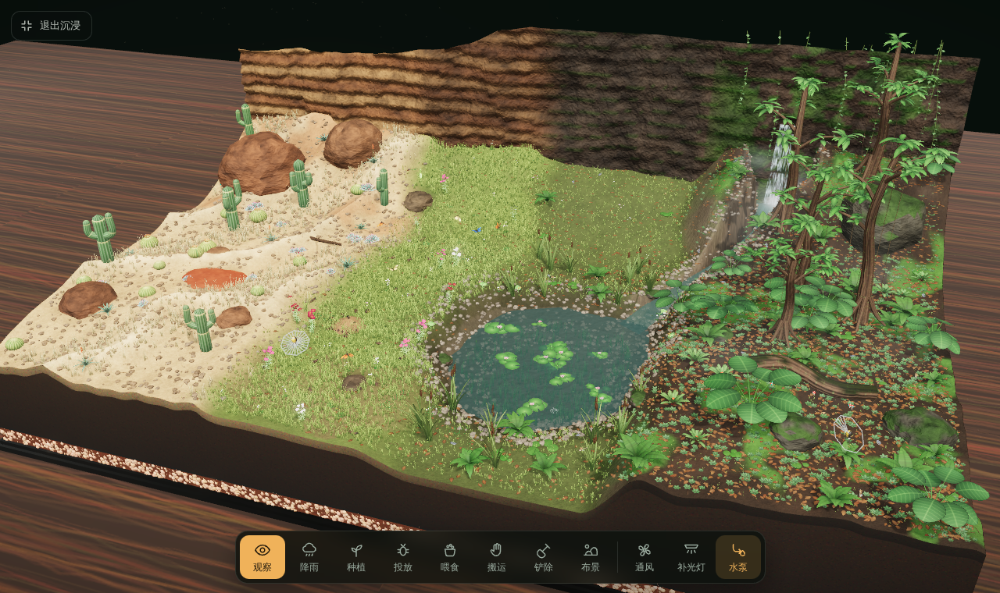
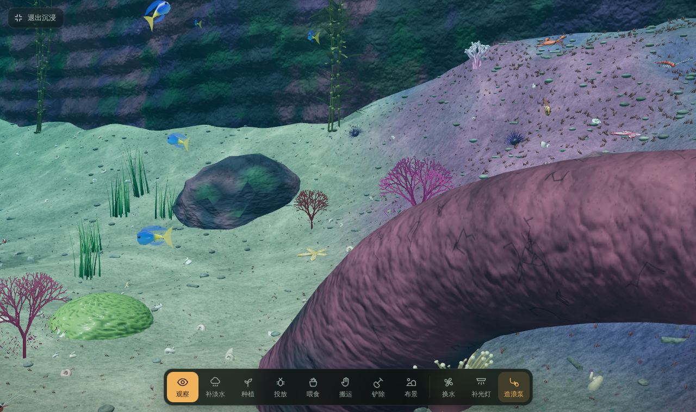
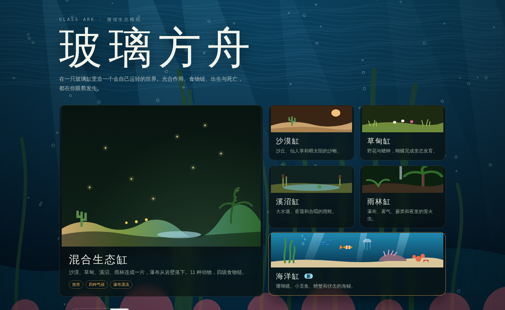
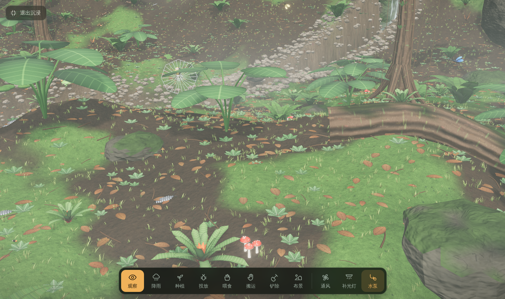
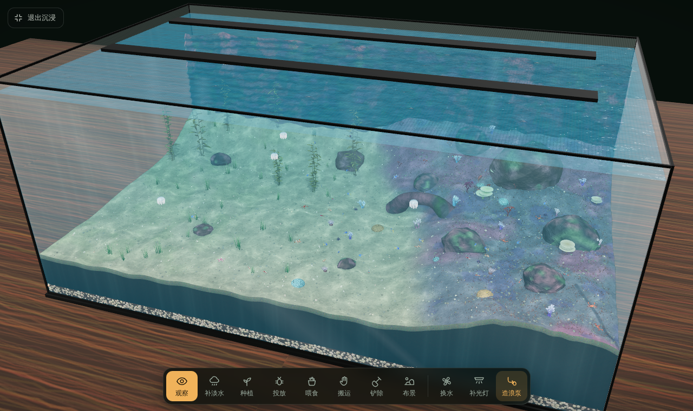

<div align="center">

# Glass Ark · 玻璃方舟

[English](README_EN.md) · [中文](README.md)

**Build a self-sustaining world inside a glass tank.**
Photosynthesis, food chains, birth and death — all unfold before your eyes.

*一款基于 three.js 的浏览器端生态缸上帝模拟器——在玻璃缸里养出一个活生生的微型世界。*



</div>

---

## What is this?

Glass Ark is a browser-based ecosystem terrarium simulator. You play as the "god" of this tiny world — but you don't control any creature directly. Instead, you shape the environment: trigger rain, plant vegetation, introduce species, adjust lighting, and watch life emerge on its own.

- Ants carry leaves back to their nest; when food stores are sufficient, new ants hatch
- Caterpillars chew on host plants, pupate, and emerge as butterflies
- Spiders spin webs, mantises ambush from branches, tree frogs catch insects with their tongues, corn snakes sit atop the food chain
- Clownfish dart into anemones when threatened, moray eels hide in reef crevices by day and hunt at night

The entire game is **a single HTML file plus a local three.js copy** — no build tools, no CDN, fully offline.

## Game Modes

| Mode | Environment | Highlights |
|---|---|---|
| **Mixed Ecosystem** (recommended) | Desert · Meadow · Stream · Rainforest connected, waterfall cascading down cliffs | Four climates, 11 animal species, four-tier food chain |
| Desert Tank | Sand dunes, cacti, heating rocks | Sand lizards basking on heating rocks at dawn |
| Meadow Tank | Wildflowers, grass, small ponds | Butterflies complete metamorphosis; crickets chirp at night |
| Stream & Swamp Tank | Large pond, cattails, water lilies | Tree frogs lay eggs, tadpoles metamorphose, chorus on rainy nights |
| Rainforest Tank | Rainforest trees, monstera, waterfall and mist | Fireflies, mushrooms, humid understory ecology |
| **Ocean Tank** | Seagrass beds, sand flats, reef crests, reef slopes | Coral reefs, fish schools, ambush predation, water quality management |



| Home | Rainforest | Ocean |
|---|---|---|
|  |  |  |

## Species

**Land (11 animal species)**: Leafcutter ants, crickets, snails, butterflies (egg → caterpillar → pupa → adult), isopods, fireflies, orb-weaver spiders, mantises, tree frogs (egg → tadpole → adult), sand lizards, corn snakes

**Land plants**: Golden barrel cactus, columnar cacti, aloe, echeveria, foxtail grass, daisies, cosmos, dandelions, clover, cattails, water lilies, ferns, moss, monstera, bromeliads, rainforest trees, and mushrooms that grow from humus

**Ocean (9 animal species)**: Blue devil damselfish, clownfish, moon jellyfish, cleaner shrimp, crabs, starfish, sea urchins, grouper, moray eel

**Ocean flora & coral**: Seagrass, giant kelp, staghorn coral, brain coral, table coral, sea fans, anemones

Higher-tier predators require their prey to be established first. For example, corn snakes need sufficient sand lizards and adult tree frogs; moray eels require groupers and crabs.

## What's Simulated

- **Gas cycling**: Plants release O₂ and absorb CO₂ during photosynthesis; animals respire around the clock. Oxygen curves update in real time
- **Moisture & humidity**: Each zone independently calculates soil moisture, air humidity, and temperature; excessive humidity triggers mold growth
- **Ocean water quality**: Water temperature, salinity (evaporation raises salinity), nutrients, plankton, algae, dissolved oxygen. Coral bleaches above 29°C; nutrient overload causes algae blooms
- **Behavior**: Every animal has hunger, reproduction, lifespan, and a state machine — foraging, stalking, striking, missing, fleeing, resting. Hunting has hit rates; they can miss
- **Events**: Afternoon showers, heat waves, visitor days, ocean heat waves, plankton blooms
- **Economy**: Ornamental value (diversity + ecological balance +精彩 moments) continuously generates spores; spores buy plants, animals, and decorations. Commissioned tasks provide phased goals

## Controls

| Action | Desktop | Mobile |
|---|---|---|
| Rotate camera | Left-click drag / Q E | Single-finger drag |
| Pan | Right-click drag | Two-finger drag |
| Zoom | Scroll wheel / R F | Pinch |
| Fly | W S move forward/backward along view direction; A D strafe; Shift to accelerate | — |
| Follow creature | Click an animal, choose "orbit / chase / its perspective" | Same |
| Switch tools | Number keys 1–8 | Bottom toolbar |
| Hide glass | G | Top button |
| Immersive mode (hide UI, keep toolbar) | H, Esc to exit | Top button, exit from top-left |
| Pause | Spacebar | Top Ⅱ |

**Tools**: Observe, rain / add fresh water, plant, introduce species, feed, move, clear (plants refund 30%, decorations refund 50%), decorate (round stones, layered rocks, driftwood, tree stumps, small waterfall rocks, heating rocks; ocean has live rock, reef arches, shipwreck debris, air stones)

**Director mode**: When enabled, the camera automatically tracks hunting, metamorphosis, hatching, and other精彩 moments — perfect for idle viewing.

## Running the Game

The game uses ES Modules, and browsers don't allow loading modules directly from double-clicked HTML files, so you need a local server. three.js is bundled in `vendor/` — **no CDN dependency, fully offline**.

- **Windows**: Double-click `start.bat`; your browser will automatically open `http://localhost:8765/` (requires Python or Node.js installed)
- **Mac / Linux**: Run `./start.sh` in terminal
- **Editor**: In VS Code, install the Live Server extension and right-click → "Open with Live Server"; JetBrains IDEs have a browser icon in the top-right
- **Manual**: Run `python -m http.server 8765` in the repository directory, then visit `http://localhost:8765/`

If a red warning bar appears at the top after opening, follow the instructions.

### Deploy to GitHub Pages

Go to repository Settings → Pages → Source: select `main` branch root directory, save, and access via `https://<username>.github.io/<repo-name>/` after a few minutes.

### Graphics Quality

Choose low / medium / high quality on the home screen or in settings. Mobile defaults to low quality: disables real-time shadows and post-processing, reduces grass density to 30%. High quality enables bloom, depth of field, and high-resolution shadows.

## Project Structure

```
.
├── index.html          # The built game
├── start.bat / start.sh  # One-click local server launcher
├── build.sh            # Concatenates src/ into index.html
├── vendor/three/       # three.js r165 and used plugins (MIT), offline-capable
├── src/
│   ├── head.html       # Page structure, styles, home screen
│   ├── js1.js          # Renderer, procedural textures, home dynamic background and mode selection
│   ├── js2.js          # Terrain, zones, water bodies, rocks, tank, underwater lighting
│   ├── js3.js          # Plants: procedural modeling, instanced rendering, growth
│   ├── js4.js          # Land animal models (skeletal tube bodies, instanced ants)
│   ├── js4o.js         # Ocean animal models (fish, moray eel, shrimp/crabs, jellyfish)
│   ├── js5.js          # Land species behavior and hunting system
│   ├── js5o.js         # Ocean species behavior
│   ├── js6.js          # Main simulation loop, weather, economy, commissions, initial ecosystem
│   ├── js7.js          # Camera, picking, tool interaction
│   ├── js7d.js         # WASD flight, decorations, clearing, bubbles
│   └── js8.js          # Sound, UI, per-frame visuals, main loop
└── docs/screenshots/
```

After modifying `src/`, run `./build.sh` to regenerate `index.html`. All models, textures, and sounds are procedurally generated in code — no external art assets in the repository.

## Technical Highlights

- **three.js r165** (local vendor), ES Module + importmap, no bundler
- Physically-based lighting units, ACES tone mapping, PCF soft shadows, RoomEnvironment ambient light, optional UnrealBloom and depth of field
- Plants and grass rendered via `InstancedMesh`; wind sway written in vertex shaders
- Snakes, lizards, tadpoles, and moray eels use custom "spine tube" skinning — bodies wind along trajectories
- Ant leg gait driven in shaders; hundreds of ants drawn in a single pass
- **Underwater lighting** references the [Tidewater](https://github.com/dgreenheck/tidewater) model:
  - Light attenuates per-channel from water surface to object following Beer-Lambert law (red light absorbed first)
  - View ray passing through water also attenuates and overlays scattered water color
  - Caustics modulate direct sunlight rather than adding brightness on top
- All sounds synthesized with Web Audio, with spatial positioning: tree frog pulse calls, cricket wing vibrations, rain sounds, waterfall sounds

## Roadmap

- [ ] Save and load
- [ ] WeChat mini-game version (block-based loading, reduced instance count on mobile)
- [ ] More species: bees, newts, octopuses, sea turtles
- [ ] Free-form terrain sculpting

## Acknowledgments

- [three.js](https://threejs.org/) (MIT)
- [Tidewater](https://github.com/dgreenheck/tidewater) (MIT, © DRG Software Solutions LLC): underwater lighting model reference
- Fonts: [ZCOOL XiaoWei](https://fonts.google.com/specimen/ZCOOL+XiaoWei), [JetBrains Mono](https://www.jetbrains.com/lp/mono/) (SIL Open Font License)

## License

**Personal use**: Free to download, run, modify, and play — no additional authorization required.

**Commercial use**: Requires prior written authorization from the author. Commercial use includes but is not limited to: paid operation, embedding in paid products, commercial promotion, or as part of a paid service.

For commercial licensing, please contact via GitHub Issues.

Code is licensed under [MIT License](LICENSE); art, sound effects, and game design creative content retain all rights (non-commercial).
